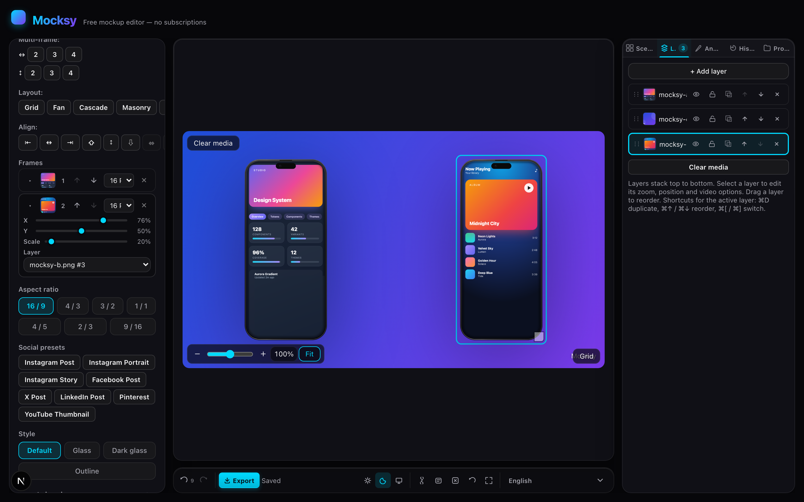

# Mocksy

[](LICENSE)

Free browser-based mockup editor. No auth, no paywall, no subscriptions — and the editor is 100% client-side: your media never leaves the device (an optional server [Spin API](#spin-api) can render PNGs for you — see below).

**Try it live: [mocksy-ashen.vercel.app](https://mocksy-ashen.vercel.app)**

> [!WARNING]
> Mocksy is under active development — bugs are expected. If you run into one, please [open an issue](https://github.com/4isper/Mocksy/issues) so it can be fixed.



Inspired by [shots.so](https://shots.so/) · [PostSpark device mockup](https://postspark.app/device-mockup)

---

## Quick start

You need [Node.js 22+](https://nodejs.org/) installed (npm comes bundled with it).

```bash
git clone https://github.com/4isper/Mocksy.git
cd Mocksy
npm install
npm run dev
```

Open [http://localhost:3000](http://localhost:3000) and start editing.

No Git? On GitHub click **Code → Download ZIP**, unpack it, then run `npm install` and `npm run dev` inside the folder.

To run an optimized production build locally instead of the dev server:

```bash
npm run build
npm start
```

> [!TIP]
> Mocksy is an installable PWA. Once it's open in your browser, use the browser's **Install App** option to launch it like a native app — it works offline.

---

## Features

### Editor

- Multi-panel layout: controls, canvas preview, layers, annotations, templates, projects
- Undo/redo (`⌘Z` / `⇧⌘Z`) with keyboard shortcuts; rapid slider drags coalesce into one step
- Rebindable keyboard shortcuts — click-to-record in the Shortcuts dialog, overrides persist and remap instantly
- Command palette (`⌘K`) with actions grouped by category and match highlighting
- Right-click context menus for canvas, frames, annotations and layers
- "Surprise me" action — randomizes style, background, shadow and corners; media stays untouched
- First-run onboarding tour (replayable from the command palette)
- Visual frame picker with device thumbnails
- Collapsible control sections with tooltips
- Resizable side panels — widths persist between sessions
- Inline status indicators (save state, export progress with cancel, copy confirmation), empty states and skeleton loading
- Light/dark/system theme toggle in the toolbar
- Error boundary with recovery (your saved scene stays safe)
- Save / unsaved status indicator with 500ms autosave debounce
- Multi-frame scenes (2–4 frames) with per-frame device select, position (X/Y/scale), portrait/landscape rotation, and layer assignment
- Auto layout presets for multi-frame scenes: grid, fan, cascade, masonry, stack
- Align (left/center/right/top/middle/bottom) and distribute buttons for frame instances
- Smart guides snap frame instances to canvas edges and sibling frames while dragging
- Drop a file onto a specific device in multi-frame mode — it targets that device's layer; dropping a batch distributes the files across empty devices
- View navigation over the canvas: smooth wheel zoom anchored at the cursor (25–400%, snaps to familiar stops), continuous slider with −/+ steps, Space+drag / middle-button panning, pinch on touch, double-click to reset — pure view state, exports are unaffected
- `⌘C`/`⌘V` copies and duplicates the selected annotation or frame instance (media paste still wins when the OS clipboard holds files)
- 3D tilt (`tiltX`/`tiltY`, ±25°) kept in sync across CSS preview, canvas/SVG exports and video
- Optional floor reflection — mirrored, fading copy of the device below its bottom edge
- Optional grid overlay with adjustable divisions
- Full-screen preview mode (`F` to toggle, `Esc` to exit)
- Undo/redo history persists to localStorage — `⌘Z` survives a page reload
- History panel: jump to any point in the undo timeline, labelled per change
- Installable PWA: service worker caches the app shell for offline use
- Localized into 57 languages via `next-intl`, with a locale switcher in the toolbar
- Respects the OS `prefers-reduced-motion` setting: the live preview shows a static frame and HTML exports ship a reduced-motion fallback

### Mockup frames

| Frame | Type | Notes |
|-------|------|-------|
| `none` | CSS | Raw rounded rectangle |
| `iphone` | Overlay | Classic phone skin, native portrait ratio |
| `iphone15` | Overlay | SVG skin, native portrait ratio |
| `iphone16pro` | Overlay | SVG skin, native portrait ratio |
| `pixel8pro` | Overlay | SVG skin, native portrait ratio |
| `galaxy24` | Overlay | SVG skin, native portrait ratio |
| `iphoneSE` | Overlay | SVG skin, native portrait ratio |
| `ipad` | Overlay | iPad Pro skin, native portrait ratio |
| `galaxyTab` | Overlay | SVG skin, native portrait ratio |
| `desktop` | Overlay | SVG skin, wide landscape monitor |
| `tablet` | Overlay | SVG skin, 4:3 tablet proportions |
| `macbook` | Overlay | MacBook Pro skin, landscape |
| `imac` | Overlay | iMac skin with stand |
| `notebook` | Overlay | Notebook skin, landscape |
| `browser` | Overlay | Browser window with editable URL in the address bar (light/dark toolbar theme) |
| `tv` | Overlay | TV skin, 16:9 |
| `watchUltra` | Overlay | Watch Ultra skin, native ratio |
| `watch` | Overlay | Watch skin, rounded-square face |
| `custom` | Overlay | Your own SVG skin — upload any device SVG with a transparent screen cutout |

- Skins ship in three finishes: graphite (default), silver and white

- Style presets: default, glass (light/dark), outline — with configurable shadow opacity and corner radius
- Scene style presets: Dark Studio, Soft Glass, Bold Gradient, Minimal, Warm
- Aspect ratios: 16:9, 4:3, 3:2, 1:1, 4:5, 2:3, 9:16

### Screen chrome

- On-screen UI decoration drawn over the media: status bar, lock-screen clock/date, home dock with app icons, home indicator
- Dark/light accent theme
- Customizable clock time and date text
- Optional diagonal light sweep (glare) over the screen media

### Media & layers

- Media & layers: images and video (iPhone HEIC/HEIF photos auto-converted), drag-drop or file picker
- Paste from clipboard (`⌘V`): screenshots and copied image/video files land in the active layer; http(s) media links paste as remote media
- Screen recording (`getDisplayMedia`): capture a tab/window into a WebM clip that lands in the active layer — via the Media section button or the command palette
- Zoom (0.8–1.5x), position X/Y, and fill/fit toggle
- Per-layer rotation and filters: brightness, contrast, saturation, blur, grayscale
- Per-layer opacity slider (0–100%) — fades the media while bezel and chrome stay crisp
- Layer locking: locked layers reject edits and deletion; visibility/duplication stay available
- Video playback speed per layer (0.5×–2×) — preview, exports and HTML embed stay in sync
- Layer management: add, duplicate, hide/show, reorder, remove
- Multi-select layers (⌘/Ctrl/Shift-click) with bulk hide/duplicate/delete and group transform (nudge, opacity, rotation, zoom applied to the whole selection)
- AI background removal (runs fully in-browser via Transformers.js; model and wasm runtime are cached after first use, so it keeps working offline)
- Unsupported file types rejected with inline error
- Opens with an offline demo image

### Animations

- Presets: zoom in/out, parallax, pan left/right, breathe, float, sway
- Easing curves between keyframes: linear, ease-in-out, ease-out, bounce, spring
- Adjustable loop duration
- Applied consistently in the live preview, video exports and HTML export

### Annotations

- Text, arrow, rectangle, circle, and blur-region annotations
- Blur regions pixel-blur whatever is beneath them (backdrop-filter in the preview/HTML, self-snapshot blur on canvas/SVG) — great for redacting screenshots
- Emoji stickers: one-click emoji text annotations at display size
- Color picker, stroke-width, and font family selection
- Text styling: font weight, italic, alignment, background box with padding and radius
- Optional entrance animation in the preview — draw-on for shapes/arrows, typewriter for text
- Draggable and resizable on canvas

### Video

- Mute / loop / autoplay toggles
- Poster frame selector
- Timeline scrubber
- Trim with dual-range control
- Background audio track upload with fade in/out
- Export quality: Low, Medium, High

### Background

- Mode tabs: solid, gradient, pattern, and image
- Solid colors, gradient presets, transparent mode
- Linear and radial gradients with an optional middle stop
- Pattern presets: dots, grid, diagonal, noise, plus, cross, triangle
- Background image upload with blur control
- Auto from media — generates a gradient from the loaded media's dominant colors

### Watermark

- Toggle on/off
- Custom text or uploaded logo image
- 4-corner positioning
- Size control (8–64px)

### Export

| Format | Scale | Notes |
|--------|-------|-------|
| PNG | 1x, 2x, 4x | Pixel-for-pixel match with preview; copy to clipboard |
| WebP | 1x, 2x, 4x | Static WebP at ~half the PNG size |
| SVG | — | Vector export: media, skins, annotations and watermark embedded as data URLs |
| HTML | — | Self-contained live-CSS mockup for single-frame and multi-frame scenes alike |
| MP4 | 1x, 2x, 4x | In-browser MediaRecorder + FFmpeg WebM→MP4 |
| WebM | 1x, 2x, 4x | Direct MediaRecorder capture, no encode — fastest, best quality |
| GIF | 1x, 2x, 4x | Palette generation for accurate colors |
| Animated WebP | 1x, 2x, 4x | FFmpeg libwebp_anim at 15fps — fraction of the MP4/GIF size |
| PDF | 1x, 2x, 4x | Single-page vector PDF via jsPDF + svg2pdf (same geometry as the SVG export); raster fallback |
| ZIP | — | Batch export: every frame instance of a multi-frame scene rendered as its own PNG |

- Reusable export presets (format + scale/size) stored in localStorage
- Platform size presets (App Store, Dribbble, X, Open Graph, Instagram, Story) — set the exact pixel size and switch the scene to the closest aspect ratio so nothing is letterboxed
- Custom export size (W×H inputs, up to 8192px) — the scene letterbox-fits into it, matching PNG and video output
- Animated exports run for a visible 3s (zoom/parallax) instead of a blink
- MP4 attaches the canvas to the DOM during recording for reliable frame capture in background tabs

### Projects

- Create, switch, rename, duplicate, import, export, delete
- Soft delete with a trash section — restore accidentally removed projects
- All projects persisted to localStorage
- Share URL carries the scene deflate-compressed (`CompressionStream`, base64url) with a legacy raw-JSON fallback; demo media is stripped and invalid payloads are normalized
- Share dialog renders a QR code for the URL
- Reset confirmation modal before clearing

### Spin API

`POST /api/spin` — a public, CORS-open endpoint that rolls a seeded "spin" roulette and returns a ready-to-embed mockup as JSON or a server-rendered PNG.

- Request body (all optional): `pack` — weighted rules (`frames`, `backgrounds`, `styles`, a `tilt`/`shadow` range, `borderRadius` pool, `aspectRatio` list, `watermark`) — plus `media` (image/video `data:` URL, ≤32MB) with `mediaType`, `seed` for deterministic output, and `format: "json" | "png"` (also selectable via `?format=`), `scale` (1–4) and `width`/`height`
- JSON response `{ scene, seed }`: a fully normalized `EditorScene` you can load straight into the editor
- PNG response: rendered server-side by headless Chromium (playwright-core) through the `[locale]/spin-render` harness, which runs the exact same pipeline as the client export — API renders match what the editor would produce; results are LRU-cached per (scene, size), and the endpoint falls back to JSON with `image: null` when the renderer is unavailable
- Deterministic: the same pack + seed always produces the same scene

---

## Stack

| Layer | Technology |
|-------|-----------|
| Framework | Next.js 16 |
| UI | React 19 |
| State | Zustand |
| Styling | Tailwind CSS v4 |
| Video | @ffmpeg/ffmpeg (client-side WebM→MP4 / GIF / WebP) |
| AI | @huggingface/transformers (in-browser background removal) |
| i18n | next-intl (57 locales) |
| Unit tests | Vitest (2,333 tests, 154 files) |
| E2E tests | Playwright (128 tests: 75 editor, 11 UX flows, 12 a11y, 9 visual regression, 7 mobile, 4 preview/export parity, 4 spin render, 2 export shadow, 2 i18n, 2 tablet) |
| Language | TypeScript (strict) |

---

## Project layout

```
app/                    Next.js router ([locale]/layout, page, error boundary, og/spin-render harness pages) + api/spin route
proxy.ts                Locale detection middleware for next-intl
components/editor/      52 React components
  EditorShell            Main orchestrator with keyboard shortcuts
  ControlPanel           Frame, style, media, background, watermark controls
  sections/              Control panel sections (frame, media, position, filters, animation)
  PreviewCanvas          Canvas renderer with drag/pan/pinch/annotations
  CommandPalette         ⌘K action search palette
  ContextMenu            Right-click menus for canvas, frames, annotations, layers
  OnboardingTour         First-run guided tour with replay from the palette
  LayersPanel            Layer list with hide/reorder/remove
  AnnotationsPanel       Annotation CRUD and editor
  TemplatesPanel         Scene style preset gallery
  ProjectsPanel          Project CRUD
   ExportDialog           PNG/WebP/SVG/HTML/PDF/MP4/WebM/GIF/Animated WebP/ZIP export modal
  ShortcutsDialog        Keyboard shortcuts cheat sheet
  VideoOptions           Video playback + trim + audio + quality
  VideoTrimControl       Dual-range trim slider
  FramePicker            Visual frame picker with custom SVG upload
  FrameInstanceGrid      Multi-frame grid layout
  FrameInstanceList      Frame instance layer list
  SingleFrameView        Single-frame canvas view
  BackgroundControls     Background mode tabs + presets
  WatermarkControls      Watermark toggle/text/logo/position/size
  AnnotationItem         Annotation list item with editor
  RightPanel             Tabbed panel (templates / layers / annotations / projects)
  TrashSection           Soft-deleted projects with restore
  ErrorBoundary          Crash recovery with retry
  ThemeProvider          Light/dark/system theme
  LocaleSwitcher         57-locale switcher with translation coverage flags
  PwaRegister            Service worker registration
  SkipLink               Skip-to-content accessibility link
  Toast                  Toast notifications
  Section / Segmented    Collapsible section and segmented control primitives
i18n/                   Locale request config + canonical locale list + generated coverage map
lib/
  state/                 Zustand stores (scene, layers, projects, theme) + normalization + share URL + history persistence
  render/                Frame specs, CSS geometry, canvas drawing, tilt projection, video timeline
  export/                PNG/WebP, SVG/HTML/PDF, MP4/WebM/GIF/WebP, batch ZIP, canvas rendering
  commands/              Command-palette command factories per feature area
  media/                 File loading, demo image, palette extraction, AI background removal
  presets/               Background swatches, scene style presets
  hooks/                 Client hooks (commands, shortcuts, frame transform, palette)
  shortcuts/             Single source of truth for keyboard shortcuts + rebinding store
  server/                Server-side PNG renderer for the spin API (headless Chromium)
  types/                 TypeScript interfaces
messages/               57 locale JSON files (en.json is the source of truth)
public/devices/          SVG device skins for overlay frames
tests/
  unit/                  Pure function and store tests
  components/            Component tests (Testing Library)
  e2e/                   Playwright end-to-end tests (editor, UX flows, visual regression, preview/export parity)
```

---

## Scripts

```bash
npm run typecheck       # TypeScript strict check
npm run test            # Vitest (2,333 tests, 154 files)
npm run test:coverage   # Unit tests with coverage report
npm run test:e2e        # Playwright (requires browser install)
npm run test:vrt        # Visual regression tests
npm run test:vrt:update # Update visual regression baselines
npm run test:lhci       # Lighthouse CI (requires built app + server)
npm run og              # Generate the Open Graph preview image
npm run i18n:sync       # Backfill English fallback into all locales
npm run i18n:report     # Untranslated key counts per locale (-- --keys for the list)
npm run audit           # Dependency + license audit check
npm run lint            # ESLint (Next.js core-web-vitals)
```

---

## Keyboard shortcuts

Press `?` in the editor (or click the Shortcuts button) for the in-app cheat sheet. `⌘` is Cmd on macOS, Ctrl on Windows/Linux. Most shortcuts are rebindable — click the pencil icon on a row and press the new combo to record it; overrides persist per browser and remap instantly.

| Shortcut | Action |
|----------|--------|
| `?` | Open shortcuts cheat sheet |
| `⌘K` / `Ctrl+K` | Open command palette |
| `⌘N` / `Ctrl+N` | New project |
| `⌘+` / `⌘−` / `⌘0` | Preview zoom in / out / reset to fit |
| `⌘Z` / `Ctrl+Z` | Undo |
| `⇧⌘Z` / `Ctrl+Y` | Redo |
| `⌘S` / `Ctrl+S` | Save to localStorage |
| `⌘V` / `Ctrl+V` | Paste image/video (or media URL) from clipboard into the active layer, or duplicate the copied annotation / frame instance |
| `⌘E` / `Ctrl+E` | Export PNG |
| `⇧⌘C` / `Ctrl+⇧C` | Copy PNG to clipboard |
| `⌘C` / `Ctrl+C` | Copy selected annotation / frame instance |
| `⇧⌘T` / `Ctrl+⇧T` | Add text annotation |
| `⇧⌘I` / `Ctrl+⇧I` | Add arrow annotation |
| `⇧⌘R` / `Ctrl+⇧R` | Add rectangle annotation |
| `⇧⌘O` / `Ctrl+⇧O` | Add circle annotation |
| `⇧⌘B` / `Ctrl+⇧B` | Add blur-region annotation |
| `⇧⌘E` / `Ctrl+⇧E` | Export MP4 |
| `⇧⌘G` / `Ctrl+⇧G` | Export GIF |
| `⇧⌘W` / `Ctrl+⇧W` | Export WebM |
| `⇧⌘P` / `Ctrl+⇧P` | Export WebP |
| `⇧⌘A` / `Ctrl+⇧A` | Export Animated WebP |
| `⇧⌘S` / `Ctrl+⇧S` | Export SVG |
| `⇧⌘H` / `Ctrl+⇧H` | Export HTML |
| `⇧⌘F` / `Ctrl+⇧F` | Export PDF |
| `↑↓←→` | Nudge the selected frame instance (hold `Shift` for a bigger step) |
| `⌘D` / `Ctrl+D` | Duplicate active layer |
| `⌘↑` / `⌘↓` | Move active layer up/down |
| `⌘[` / `⌘]` | Select previous / next layer |
| `⌘1` / `⌘2` / `⌘3` | Switch to the Layers / Annotations / History panel |
| `F` | Toggle full-screen preview |
| `Esc` | Exit full-screen preview |
| `R` | Reset to defaults |

All layer shortcuts are ignored while typing in a text field.

---

## Responsive design

The editor locks to the viewport height (`100dvh`) and never scrolls as a page. The preview stays fully visible at any aspect ratio (including portrait 9/16). Side panels scroll internally when content overflows.

Below 980px wide the layout collapses to a single stacked column for tablets and phones.

The preview canvas uses:
- Container-query units (`cqw`/`cqh`) for aspect-ratio sizing
- `touch-action: none` to prevent browser zoom on pinch
- Pointer events for drag-to-pan and pinch-to-zoom
